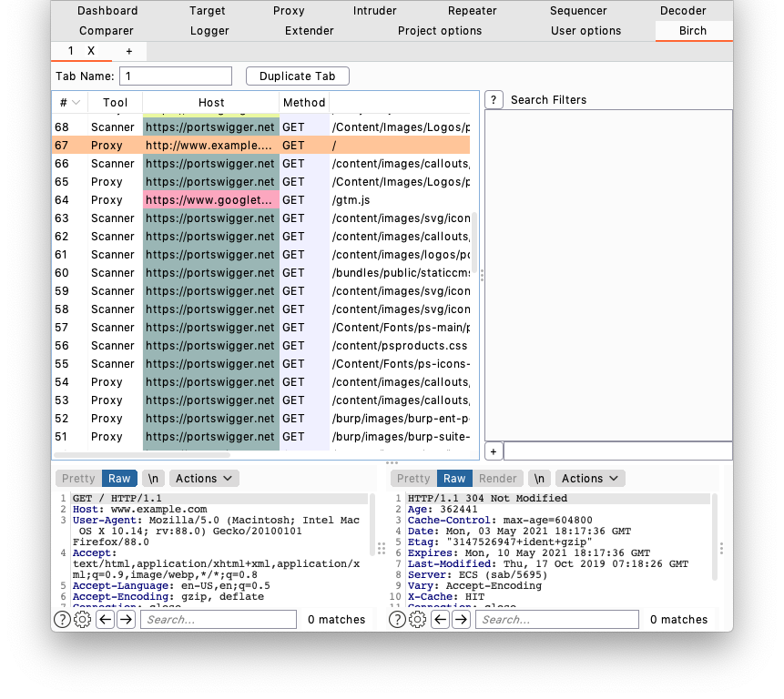
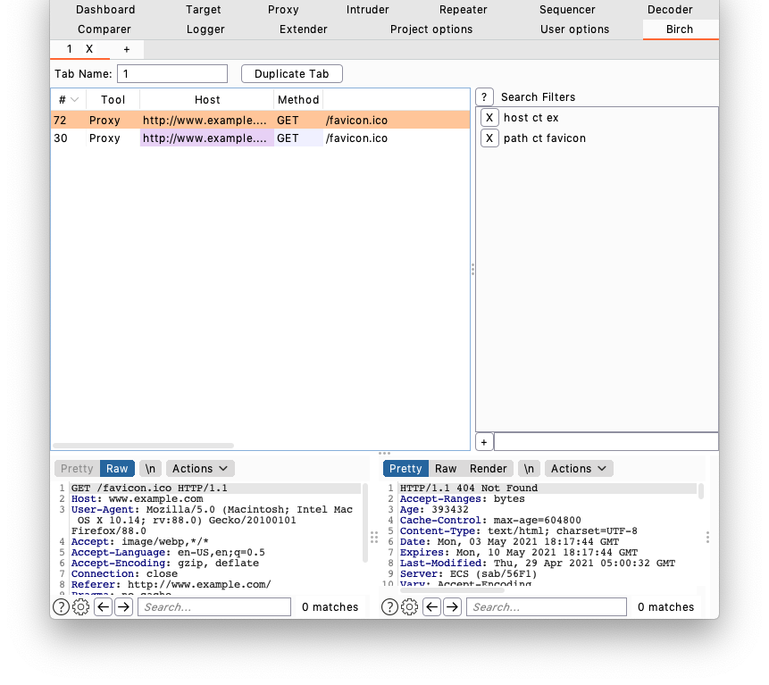

# Birch Search: Better Burp Search



Birch search is an extension for [Burp Suite](https://portswigger.net/burp) (a tool commonly used for testing web applications and HTTP endpoints) to provide better search capabilities than Burp provides by default. Birch search lets you better take advantage of all of the requests that are passed through and recorded by Burp Suite.

## Features

* Search by any HTTP field (method, headers, cookies, message bodies, etc)
* Search results are dynamically updated as requests pass through the proxy
* Multiple search tabs
* Records and persistently saves requests sent through the repeater
* Manually add requests from other tools to Birch's history to persistently save/search them
* Color-coding to improve request history view (dark mode support!)

## Howto

### Saving Non-Proxy-History Requests

Birch can record HTTP requests from other tools to its own history (this is stored separately from Burp's built-in proxy history). Requests can be saved by selecting the requests you want to save in another tool, right clicking them, and selecting "Add to Birch history" from the context menu. Requests sent through the repeater are automatically recorded.

### Applying Filters



You can enter any number of search conditions in the pane on the right. Only requests which match ALL of the search conditions will appear in the request list.

Most filter strings have the following format:

```
<field> <comparer> <value>
```

Where `<field>` is some part of the request/response, `<comparer>` is some comparison to `<value>`. For example, if you wanted a filter that only matches requests to `target.org`, you could use the following filter string:

```
host is target.org

field = "host"
comparer = "is"
value = "target.org"
```

For fields that are a list of key/value pairs (headers, get params, post params, and cookies) you can use the following format:

```
<field> <comparer1> <value1>[ <comparer2> <value2>]
```

This is a little more complicated. If you don't give comparer2/value2, the filter will pass any pair where the key or the value matches comparer1 and value1. If you do give comparer2/value2, the key must match comparer1/value1 and the value must match comparer2/value2 For example:

```
Filter A:
    cookie contains Session

Filter B:
    cookie contains Session contains 456

Filter C:
    inv cookie contains Ultra

Cookie: SuperSession=abc123
Matches A and C but not B

Cookie: UltraSession=abc123456
Matches both A and B but not C
```

### List of fields

| Field Name | Aliases | Description | Format |
|:--------|:------------|:-----|:------|
| all | all | Anywhere in the request, response, or a websocket message | String |
| reqbody | reqbody, reqbd, qbd, qdata, qdt | The body of the request | String |
| rspbody | rspbody, rspbd, sbd, sdata, sdt | The body of the response | String |
| body | body, bd, data, dt | The body in either the request or the response | String |
| method | method, verb, vb | The request method (GET, POST, etc) | String |
| host | host, domain, hs, dm | The host that the request was sent to | String |
| path | path, pt | The path of the request | String |
| url | url | The full URL of the request | String |
| statuscode | statuscode, sc | The status code of the response (200, 404, etc) | String |
| tool | tool | The tool that this request came from | String |
| reqheader | reqheader, reqhd, qhd | A header in the request | Key/Value |
| rspheader | rspheader, rsphd, shd | A header in the response | Key/Value |
| header | header, hd | A header in the request or the response | Key/Value |
| param | param, pm | Any request parameter (body, json, multipart attribute, url, xml, xml attribute) | Key/Value |
| urlparam | urlparam, uparam | A URL parameter of the request | Key/Value |
| postparam | postparam, pparam | A post parameter of the request | Key/Value |
| rspcookie | rspcookie, rspck, sck | A cookie set by the response | Key/Value |
| reqcookie | reqcookie, reqck, qck | A cookie submitted by the request | Key/Value |
| cookie | cookie, ck | A cookie sent by the request or a cookie set by the response | Key/Value |

### List of comparers

| Field Name | Aliases | Description |
|:--------|:------------|:-----|
| is | is | Exact string match |
| iscs | iscs | Same as the `is` comparer but case-sensitive |
| contains | contains, ct | A contains B is true if B is a substring of A |
| containscs | containscs, ctcs | Same as the `contains` comparer but case-sensitive  |
| containsr | containsr, ctr | A containr B is true if A matches regexp B |
| leneq | leneq | A Leq B if A's length equals B (B must be a number) |
| lengt | lengt | A Lgt B if A's length is greater than B (B must be a number ) |
| lenlt | lenlt | A Llt B if A's length is less than B (B must be a number) |

### Special form filters

A few filters don't conform to the field, comparer, value format. You can still negate these.

| Format | Aliases | Description |
|:--|:--|:--|
| invert <filter string> | invert, inv | Inverts a filter string. Anything that matches the filter string will not pass the filter. |

Examples:

```
Show state-changing requests
  inv method is GET

Show requests without a csrf parameter
  inv param ct csrf
```

## Tips

* A useful workflow is to set up a base search then add/remove a few filters to perform more specific searches. For example you might:
  * Add a filter to show all state-changing requests: `inv method is GET`
  * Only view state-changing requests that succeeded: `sc ctr ^2`
  * Look for requests without a CSRF header: `inv hd ct csrf`
  * Decide you want to see state-changing requests with a user id so you remove the header filter and add `pparam ct user`
* Don't be afraid to add small, specific filters to explicitly remove results you don't want
  * For example, if you search for state-changing requests with `inv method is GET` and see that a vast majority of requests are to `/poll-update`, explicitly remove that one path with `inv path is /poll-update`
  * Personally, I often have to remove multiple specific paths to get useful search results
* You can have a tab dedicated to a useful view without necessarily having to use it to perform specific searches
  * For example, a tab showing state-changing requests that succeed
  * A tab with a more general search is also useful for duplicating into more tabs

### Filter Examples

* Show state changing requests: `inv sc is GET`
  * This is a very good filter to apply before applying more specific filters afterwards
* Only show requests that succeeded: `sc ctr ^2`
* Check for requests with a specific header: `hd ct value ex`
* Find the response that set a cookie: `sck ct session ex`
* Show requests to files with a specific extension: `path ctr "\.json$"`
  * You can hide those requests with `inv`
  * Hide static files: `inv path ctr "(\.js$|\.css$|\.woff$)"`
  * Hide images: `inv path ctr "(\.png$|\.jpg$|\.jpeg$|\.gif$|\.ico$|\.bmp$|\.svg$)"`
  * Both combined for easy copy/paste: `inv path ctr "(\.png$|\.jpg$|\.jpeg$|\.gif$|\.ico$|\.bmp$|\.svg$|\.js$|\.css$|\.woff$)"`

## Burp Extension Restrictions

Burp does not have a supported way for extensions to persist data in the project file. As a result, Birch saves data by creating fake entries in the target map.

* Settings are stored in the target map as (created but not sent) requests to `http://birch-settings`. Deleting this entry will clear any saved data from the extension.
* Persisted requests are stored in the target map as (created but not sent) requests to `http://birch-request-history`. Deleting this entry will delete any saved requests outside of what Burp saves in its own proxy history. Each request corresponds to a saved request so individual requests can be deleted in the target map (requires disabling/reenabling the extension to actually remove it from view)
